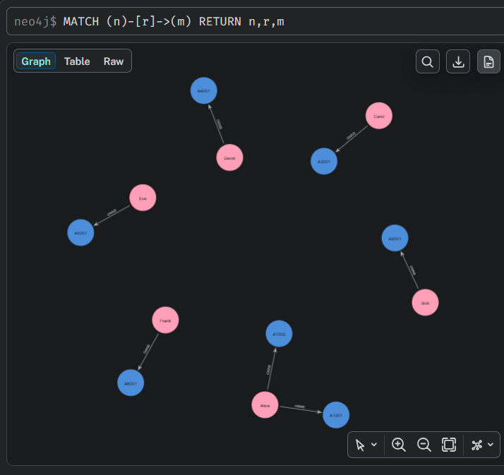

# AMLGraph

> Building Anti-Money Laundering graph applications with F#, Neo4j, and a domain-driven architecture.

<p align="center">
    
</p>

AMLGraph is a learning project and reference implementation for building Anti-Money Laundering (AML) graph applications using F# and Neo4j. The project emphasizes clean architecture, explicit domain modeling, validation, and graph-based analysis over framework complexity or premature optimization.

## Why this project?

Many Neo4j examples focus primarily on Cypher queries or graph algorithms.

AMLGraph instead explores how to design a graph application from the ground up using strongly typed domain models, validation, explicit identity rules, and clear architectural boundaries.

The project intentionally favors readability, explicit behavior, and maintainability over framework magic.

## Goals

* Learn Neo4j and Cypher through a realistic AML domain
* Explore graph modeling techniques used in fraud detection and financial crime
* Demonstrate a clean F# architecture for graph applications
* Model institution-scoped customer and account identities explicitly
* Serve as a foundation for experimenting with entity resolution, graph analytics, and AML investigations

---

## Current Status

```text
✔ Person import
✔ Customer import
✔ Institution import
✔ Account import
✔ Composite Customer and Account identities
✔ Person-to-Customer relationships
✔ Customer-to-Account ownership relationships
✔ Account-to-Institution relationships
✔ Domain validation
✔ Synthetic data library
✔ Expecto validation test suite
◻ Transactions
◻ Contact and identity relationships
◻ Entity resolution
◻ Graph analytics
◻ AML investigations
```

---

## Current Graph Model

```text
(Person)
    |
    | HAS_CUSTOMER_RECORD
    ▼
(Customer)
    |
    | OWNS
    ▼
(Account)
    |
    | HELD_AT
    ▼
(Institution)
```

The model distinguishes a real-world `Person` from an institution-specific `Customer`.

A Person may have Customer records at multiple Institutions. A Customer may own multiple Accounts, and multiple Customers may jointly own the same Account.

Customer and Account identifiers are institution-scoped:

```text
Person       → PersonId
Institution  → InstitutionId
Customer     → CustomerId + InstitutionId
Account      → AccountId + InstitutionId
```

This allows the same `CustomerId` or `AccountId` to appear at different financial institutions without incorrectly representing them as the same node.

---

## Current Features

* Read AML data from tab-delimited files
* Convert source records into strongly typed domain objects
* Validate Person, Customer, Institution, Account, and Ownership data
* Detect conflicting duplicate records
* Validate references between dependent domain objects
* Accumulate multiple validation errors when appropriate
* Create Neo4j nodes using `MERGE`
* Create `HAS_CUSTOMER_RECORD`, `OWNS`, and `HELD_AT` relationships
* Represent joint account ownership
* Represent one Person as a Customer of multiple Institutions
* Enforce node identity using Neo4j constraints and composite node keys
* Organize parsing, validation, graph persistence, and infrastructure separately
* Support idempotent imports so repeated runs do not create duplicate graph objects
* Use synthetic data for automated tests with no production records or personally identifiable information

---

## Technology Stack

* F#
* .NET
* Neo4j
* Cypher
* Neo4j .NET Driver
* Expecto

---

## Project Structure

```text
AMLGraph
│
├── AMLGraph.slnx
│
├── AMLGraph.App
│   ├── Program.fs
│   ├── Reader
│   ├── Graph
│   │   ├── Nodes
│   │   └── Relationships
│   └── Infrastructure
│       ├── Neo4j.fs
│       └── Schema.fs
│
├── AMLGraph.Domain
│   ├── Domain.fs
│   └── Validation
│       ├── Person.fs
│       ├── Customer.fs
│       ├── Institution.fs
│       ├── Account.fs
│       └── Ownership.fs
│
├── AMLGraph.SyntheticData
│   ├── SyntheticPerson.fs
│   ├── SyntheticCustomer.fs
│   ├── SyntheticInstitution.fs
│   ├── SyntheticAccount.fs
│   └── SyntheticOwnership.fs
│
├── AMLGraph.Tests
│   └── Validation
│       ├── Person.fs
│       ├── Customer.fs
│       ├── Institution.fs
│       ├── Account.fs
│       └── Ownership.fs
│
└── Docs
    ├── ARCHITECTURE.md
    └── DECISIONS.md
```

---

## Execution

```text
dotnet run --project AMLGraph.Tests

dotnet run --project AMLGraph.App
```

---

## Domain Identity

AMLGraph uses strongly typed identifiers rather than primitive strings.

Basic identifiers include:

```text
PersonId
CustomerId
AccountId
InstitutionId
```

Customer and Account identities are institution-scoped:

```text
UniqueCustomerId = CustomerId + InstitutionId
UniqueAccountId  = AccountId + InstitutionId
```

Ownership explicitly identifies both endpoints:

```text
OwnershipId = UniqueCustomerId + UniqueAccountId
```

These identity rules are enforced by domain validation and, for Neo4j nodes, schema constraints.

---

## Validation

Validation occurs after parsing and before graph creation.

Each validator operates on domain objects rather than raw file data.

Current validation covers:

```text
Person
Customer
Institution
Account
Ownership
```

Validation includes:

* Deduplication of identical records
* Detection of conflicting records with the same identity
* Institution validation for Customer and Account records
* Customer and Account reference validation for Ownership
* Institution consistency between the Customer and Account in an Ownership
* Accumulation of multiple validation errors when multiple rules fail

`HAS_CUSTOMER_RECORD` and `HELD_AT` do not require independent validation because they are derived from validated Customer and Account records.

---

## Import Pipeline

```text
Read Persons
      ↓
Validate Persons

Read Institutions
      ↓
Validate Institutions

Read Customers
      ↓
Validate Customers
      ↓
requires validated Institutions

Read Accounts + Ownerships
      ↓
Validate Accounts
      ↓
requires validated Institutions

Validate Ownerships
      ↓
requires validated Customers + Accounts

Create Person Nodes
Create Institution Nodes
Create Customer Nodes
Create Account Nodes
      ↓
Create HAS_CUSTOMER_RECORD Relationships
Create OWNS Relationships
Create HELD_AT Relationships
```

---

## Example Graph Behavior

The current model can represent a Person who:

* Is a Customer of multiple financial institutions
* Owns multiple Accounts at one Institution
* Has Accounts at multiple Institutions
* Jointly owns an Account with another Customer

For example:

```text
                    Person Alice
                    /          \
                   /            \
          Customer/FI001     Customer/FI002
             /     \               |
            /       \              |
           ▼         ▼             ▼
       Account     Account       Account
                      ▲
                      |
                     OWNS
                      |
                Customer/FI001
                      |
                  Person Bob
```

This structure preserves the distinction between real-world identity, institution-specific customer records, accounts, and financial institutions.

---

# Extension Strategy

New graph concepts should be introduced according to the needs of the domain rather than through a fixed amount of scaffolding.

A new concept may require:

1. A domain type or identifier
2. Reader support if the concept originates in source data
3. Validation if the concept has independent business rules
4. A graph node or relationship module
5. Program orchestration
6. Synthetic data and automated tests where business behavior needs verification

Relationships that can be deterministically derived from already validated domain objects do not necessarily require their own reader or validation module.

The architecture is intended to grow by extension while avoiding abstractions that have not yet demonstrated a need.

See **ARCHITECTURE.md** for architectural details and **DECISIONS.md** for the reasoning behind major design choices.
