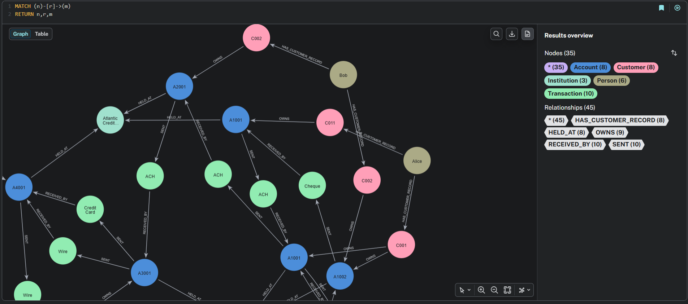

# AMLGraph

> Building Anti-Money Laundering graph applications with F#, Neo4j, and a domain-driven architecture.

<p align="center">
    
</p>

AMLGraph is a learning project and reference implementation for building Anti-Money Laundering (AML) graph applications using F# and Neo4j. The project emphasizes clean architecture, explicit domain modeling, validation, and graph-based analysis over framework complexity or premature optimization.

## Why this project?

AMLGraph was inspired by the article [How to Build a Simple Fraud Alert System Using Neo4j](https://www.drivewingrow.com/how-to-build-a-simple-fraud-alert-system-using-neo4j) from DriveWinGrow. The article demonstrates how graph databases can be used to model financial relationships and identify potentially suspicious transaction patterns.

This project uses that idea as a starting point to explore domain modeling, data validation, and graph construction in F# and Neo4j.  F# is used to model the financial domain with strongly typed identifiers, discriminated unions, immutable records, and explicit validation of data before it is persisted to the graph.

Many Neo4j examples focus primarily on Cypher queries or graph algorithms.  AMLGraph instead explores how to design a graph application from the ground up using strongly typed domain models, validation, explicit identity rules, and clear architectural boundaries.

The project intentionally favors readability, explicit behavior, and maintainability over framework magic.

## Data Source

When searching for a reasonable dataset to use for this project, I came across the paper [*Realistic Synthetic Financial Transactions for Anti-Money Laundering Models*](https://arxiv.org/pdf/2306.16424). The paper describes both the challenges financial institutions face when developing and evaluating anti-money-laundering models and the difficulty of obtaining realistic financial transaction data with known money-laundering activity.

The researchers developed **AMLworld**, an agent-based simulator that creates a synthetic multi-bank financial system. Rather than generating isolated suspicious transactions, AMLworld simulates a broader economy containing banks, accounts, individuals and companies conducting ordinary financial activity. Known money-laundering patterns are then introduced into this simulated economy. Because the data is synthetic, the researchers know which transactions are associated with laundering, providing ground truth that is generally unavailable in real financial data. The AMLworld data and supporting information are available through the [IBM AML-Data repository](https://github.com/IBM/AML-Data).

The complete simulation is much larger and more detailed than AMLGraph requires. AMLGraph focuses primarily on people, the accounts they own at financial institutions, the movement of funds between those accounts, and the graph structures that may indicate money laundering.

IBM therefore provides several generated datasets of different sizes and laundering prevalence through the [IBM Transactions for Anti-Money Laundering (AML) dataset on Kaggle](https://www.kaggle.com/datasets/ealtman2019/ibm-transactions-for-anti-money-laundering-aml). The datasets are divided into **HI** (higher illicit) and **LI** (lower illicit) groups, with small, medium, and large versions of each.

AMLGraph's initial development uses a small, handcrafted synthetic dataset to establish and test the domain model, validation rules, and Neo4j integration. The next phase will introduce **`LI-Small_Trans.csv`**, the small, lower-illicit transaction dataset from IBM. Despite being the smallest LI dataset, it contains millions of synthetic transactions spanning multiple financial institutions. Each transaction identifies the sending and receiving banks and accounts, amounts and currencies paid and received, payment format, timestamp, and whether the transaction is known to be associated with money laundering. Companion data identifies accounts and known laundering patterns, making it possible to examine both individual transactions and the larger graph structures formed as funds move among accounts and institutions.

This combination—the research describing how and why the data was generated, the synthetic multi-bank transaction network, and known laundering patterns—makes the dataset particularly useful for AMLGraph. It provides a realistic setting for exploring how graph-based representations can expose relationships and transaction patterns that may not be apparent when transactions are considered individually.

## Goals

* Learn Neo4j and Cypher through a realistic AML domain
* Explore graph modeling techniques used in fraud detection and financial crime
* Demonstrate a clean F# architecture for graph applications
* Model institution-scoped customer and account identities explicitly
* Serve as a foundation for experimenting with shared contact relationships, graph analytics, and AML detection techniques

---

## Current Status

```text
✔ Person import
✔ Customer import
✔ Institution import
✔ Account import
✔ Transaction import and validation
✔ Composite Customer and Account identities
✔ Person-to-Customer relationships
✔ Customer-to-Account ownership relationships
✔ Account-to-Institution relationships
✔ Account-to-Transaction SENT relationships
✔ Transaction-to-Account RECEIVED_BY relationships
✔ Domain validation
✔ Synthetic data library
✔ Expecto domain validation tests
◻ IBM AML dataset ingestion
◻ Shared contact relationships (address, phone, email)
◻ Graph analytics
◻ AML pattern detection
```

---

## Current Graph Model

```text
(Person)
    |
    | HAS_CUSTOMER_RECORD
    ▼
(Customer)
    |
    | OWNERSHIP
    ▼
(Account) ─── HELD_AT ───▶ (Institution)
    |
    | SENT
    ▼
(Transaction)
    |
    | RECEIVED_BY
    ▼
(Account)
```

The model distinguishes a real-world `Person` from an institution-specific `Customer`.

A Person may have Customer records at multiple Institutions. A Customer may own multiple Accounts, and multiple Customers may jointly own the same Account.

Customer and Account identifiers are institution-scoped:

```text
Person       → PersonId
Institution  → InstitutionId
Customer     → CustomerId + InstitutionId
Account      → AccountId + InstitutionId
```

This allows the same `CustomerId`, `AccountId`, or `TransacationId` to appear at different financial institutions without incorrectly representing them as the same node.

Transactions represent the movement of funds between Accounts. Each Transaction is connected to its originating Account through a `SENT` relationship and to its destination Account through a `RECEIVED_BY` relationship. Transactions may connect Accounts held at different Institutions.

---

## Current Features

* Read AML data from tab-delimited files
* Convert source records into strongly typed domain objects
* Validate Person, Customer, Institution, Account, Ownership, and Transaction data
* Detect conflicting duplicate records
* Validate references between dependent domain objects
* Accumulate multiple validation errors when appropriate
* Create Neo4j nodes using `MERGE`
* Create `HAS_CUSTOMER_RECORD`, `OWNERSHIP`, `HELD_AT`, `SENT`, and `RECEIVED_BY` relationships
* Represent joint account ownership
* Represent one Person as a Customer of multiple Institutions
* Represent institution-scoped Transaction identity and cross-institution fund transfers
* Enforce node identity using Neo4j constraints and composite node keys
* Organize parsing, validation, graph persistence, and infrastructure separately
* Rebuild the graph from validated data on each run, using `MERGE` for node and relationship creation
* Use synthetic data for automated tests with no production records or personally identifiable information

---

## Technology Stack

* F#
* .NET
* Neo4j
* Cypher
* Neo4j .NET Driver
* Expecto

---

## Project Structure

```text
AMLGraph/
├── README.md
├── AMLGraph.slnx
├── AMLGraph.App/
│   ├── Data/
│   │   ├── Accounts.tsv
│   │   ├── Customers.tsv
│   │   ├── Institutions.tsv
│   │   ├── Persons.tsv
│   │   └── Transactions.tsv
│   ├── Graph/
│   │   ├── Nodes/
│   │   │   ├── Account.fs
│   │   │   ├── Customer.fs
│   │   │   ├── Institution.fs
│   │   │   ├── Person.fs
│   │   │   └── Transaction.fs
│   │   └── Relationships/
│   │       ├── HasCustomerRecord.fs
│   │       ├── HeldAt.fs
│   │       ├── Ownership.fs
│   │       ├── ReceivedBy.fs
│   │       └── Sent.fs
│   ├── Infrastructure/
│   │   ├── Neo4j.fs
│   │   └── Schema.fs
│   ├── Reader/
│   │   ├── Account.fs
│   │   ├── Customer.fs
│   │   ├── Institution.fs
│   │   ├── Person.fs
│   │   └── Transaction.fs
│   ├── AMLGraph.App.fsproj
│   ├── GraphData.fs
│   ├── Import.fs
│   └── Program.fs
├── AMLGraph.Domain/
│   ├── Validation/
│   │   ├── Account.fs
│   │   ├── Customer.fs
│   │   ├── Institution.fs
│   │   ├── Ownership.fs
│   │   ├── Person.fs
│   │   └── Transaction.fs
│   ├── AMLGraph.Domain.fsproj
│   └── Domain.fs
├── AMLGraph.Reporting/
│   ├── AMLGraph.Reporting.fsproj
│   └── ValidationReport.fs
├── AMLGraph.SyntheticData/
│   ├── AMLGraph.SyntheticData.fsproj
│   ├── SyntheticAccount.fs
│   ├── SyntheticCustomer.fs
│   ├── SyntheticInstitution.fs
│   ├── SyntheticOwnership.fs
│   ├── SyntheticPerson.fs
│   └── SyntheticTransaction.fs
└── AMLGraph.Tests/
    ├── Validation/
    │   ├── Account.fs
    │   ├── Customer.fs
    │   ├── Institution.fs
    │   ├── Ownership.fs
    │   ├── Person.fs
    │   └── Transaction.fs
    ├── AMLGraph.Tests.fsproj
    └── Program.fs
```

---

## Domain Identity

AMLGraph uses strongly typed identifiers rather than primitive strings.

Basic identifiers include:

```text
PersonId
CustomerId
AccountId
InstitutionId
```

Customer, Account and Transaction identities are institution-scoped:

```text
UniqueCustomerId = CustomerId + InstitutionId
UniqueAccountId     = AccountId + InstitutionId
UniqueTransactionId = TransactionId + FromInstitutionId
```

Ownership explicitly identifies both endpoints:

```text
OwnershipId = UniqueCustomerId + UniqueAccountId
```

The originating institution in `UniqueTransactionId` is derived from the Transaction's `FromAccount` key, not stored as a separate field in the domain record. These identity rules are enforced by domain validation and, for Neo4j nodes, schema constraints.

---

## Validation

Validation occurs after parsing and before graph creation.

Each validator operates on domain objects rather than raw file data.

Current validation covers:

```text
Person
Customer
Institution
Account
Ownership
```

Validation includes:

* Deduplication of identical records
* Detection of conflicting records with the same identity
* Institution validation for Customer and Account records
* Customer and Account reference validation for Ownership
* Institution consistency between the Customer and Account in an Ownership
* Accumulation of multiple validation errors when multiple rules fail
* Transaction deduplication and detection of conflicting attributes for the same `UniqueTransactionId`
* Verification of originating and destination Account references and their Institutions

`HAS_CUSTOMER_RECORD`, `HELD_AT`, `SENT`, and `RECEIVED_BY` do not require independent validation because they are derived from validated domain entities.

### Testing

Domain validation is tested using Expecto and synthetic data defined in `AMLGraph.SyntheticData`.

Tests cover valid entities, duplicate records, conflicting attributes, missing references, and institution-scoped identity rules.

Currently, automated testing is limited to domain validation. Data ingestion, Neo4j persistence, and graph relationship creation have not yet been covered by automated tests.

---

## Import Pipeline

```text
Read Persons → Validate Persons
Read Institutions → Validate Institutions
Read Customers → Validate Customers
    requires validated Institutions
Read Accounts + Ownerships
    ↓
Validate Accounts
    requires validated Institutions
Validate Ownerships
    requires validated Customers + Accounts
Read Transactions → Validate Transactions
    requires validated Accounts + Institutions
    ↓
Report Import and Validation Results
    ↓
Clear Existing Graph
    Delete all nodes and relationships
    ↓
Create Person, Institution, Customer,
Account, and Transaction Nodes
    ↓
Create Relationships
    HAS_CUSTOMER_RECORD
    OWNERSHIP
    HELD_AT
    SENT
    RECEIVED_BY
```

The import process clears existing nodes and relationships before rebuilding the graph. Schema initialization manages the currently defined constraints but does not automatically remove obsolete constraints from earlier versions.

---

## Example Graph Behavior

The current model can represent a Person who:

* Is a Customer of multiple financial institutions
* Owns multiple Accounts at one Institution
* Has Accounts at multiple Institutions
* Jointly owns an Account with another Customer

For example:

```text
                    Person Alice
                    /          \
                   /            \
          Customer/FI001     Customer/FI002
             /     \               |
            /       \              |
           ▼         ▼             ▼
       Account     Account       Account
                      ▲
                      |
                     OWNERSHIP
                      |
                Customer/FI001
                      |
                  Person Bob
```

A transfer between accounts at different institutions can be represented as:

```text
(Account A / FI001)
        |
       SENT
        ▼
   (Transaction)
        |
    RECEIVED_BY
        ▼
(Account B / FI002)
```

This structure preserves the distinction between real-world identity, institution-specific customer records, accounts, and financial institutions. Transactions extend the model by representing the movement of funds between accounts, including accounts held at different institutions.

---

# Extension Strategy

New graph concepts should be introduced according to the needs of the domain rather than through a fixed amount of scaffolding.

A new concept may require:

1. A domain type or identifier
2. Reader support if the concept originates in source data
3. Validation if the concept has independent business rules
4. A graph node or relationship module
5. Program orchestration
6. Synthetic data and automated tests where business behavior needs verification

Relationships that can be deterministically derived from already validated domain objects do not necessarily require their own reader or validation module.

The architecture is intended to grow by extension while avoiding abstractions that have not yet demonstrated a need.

See **ARCHITECTURE.md** for architectural details and **DECISIONS.md** for the reasoning behind major design choices.

---

## Getting Started

### Prerequisites

To build and run AMLGraph locally, you will need:

* [.NET 10 SDK](https://dotnet.microsoft.com/download) - includes the F# compiler and tooling
* [Neo4j Desktop](https://neo4j.com/download/)
* Neo4j Driver - install with `dotnet add package Neo4j.Driver`

AMLGraph is designed to run against a local Neo4j database.

### Clone the Repository

```powershell
git clone https://github.com/bmilhollin/AMLGraph
cd AMLGraph
```

### Configure Neo4j

Start a local Neo4j instance using the standard `neo4j` username. The application connects to the default database named `neo4j`, as specified in `Neo4j.fs`. The Neo4j Desktop instance may have a different name.

AMLGraph connects to Neo4j at:

```text
bolt://localhost:7687
```

The Neo4j password is supplied through the `NEO4J_PASSWORD` environment variable and is not stored in the repository.

In PowerShell, set the password for the current terminal session:

```powershell
$env:NEO4J_PASSWORD = "your-neo4j-password"
```

### Build and Test

From the repository root:

```powershell
dotnet build AMLGraph.slnx
dotnet test AMLGraph.slnx
```

### Run AMLGraph from AMLGraph.App directory

```powershell
dotnet run
```

The application initializes the Neo4j schema, reads and validates the synthetic AML data, reports validation results, and rebuilds the graph using validated entities. Existing nodes and relationships are deleted before graph creation; schema initialization currently recreates the node-key constraints.

The sample data in `AMLGraph.App/Data` includes intentionally invalid records to demonstrate validation error reporting. Automated tests currently cover domain validation only. Later, the dataset will be external and the app can run from the root directory with `dotnet run --project AMLGraph.App`.


